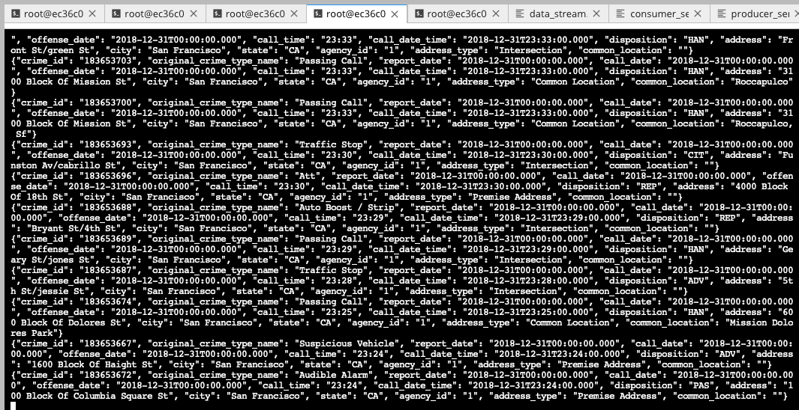
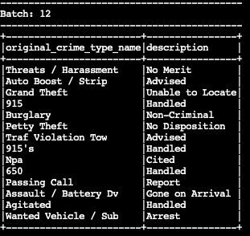
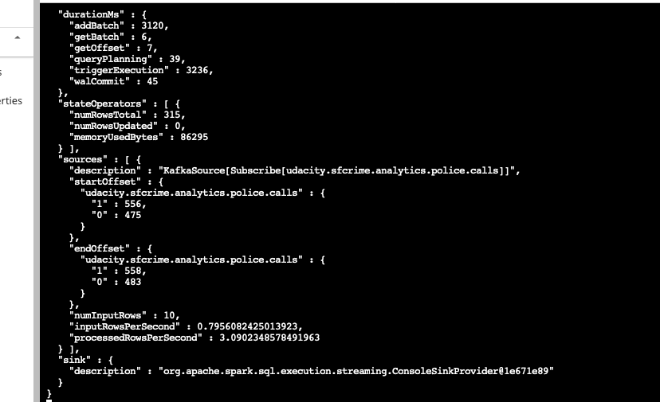
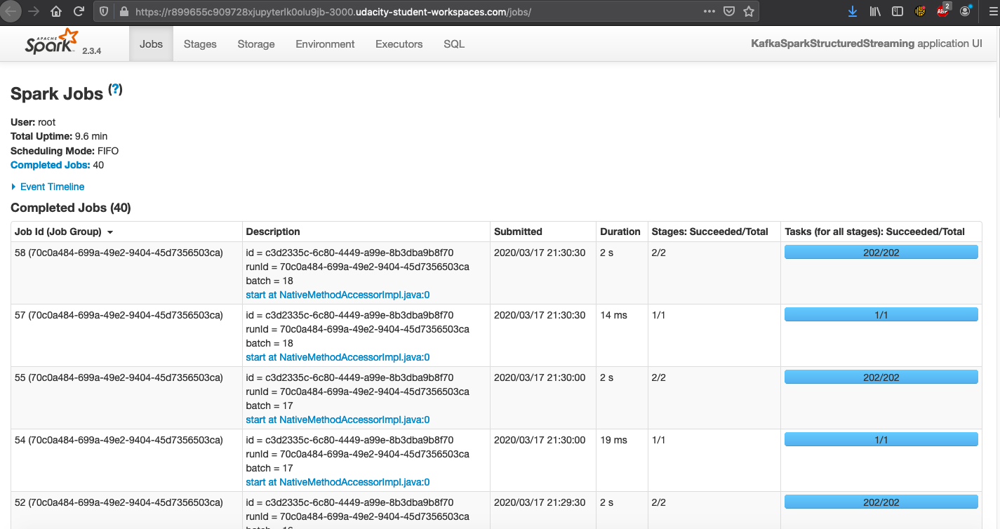

# SF Crime Statistics with Spark Streaming

## Project overview 

In this project, we use a real-world dataset, extracted from Kaggle, on San Francisco crime incidents, and we will provide statistical analyses of the data using Apache Spark Structured Streaming.

## Development Environment

You may choose to create your project in the workspace we provide here, or if you wish to develop your project locally, you will need to set up your environment properly as described below:

- Spark 2.4.3
- Scala 2.11.x
- Java 1.8.x
- Kafka build with Scala 2.11.x
- Python 3.6.x or 3.7.x

## Beginning the Project

This project requires creating topics, starting Zookeeper and Kafka servers, and your Kafka bootstrap server. You’ll need to choose a port number (e.g., 9092, 9093..) for your Kafka topic, and come up with a Kafka topic name and modify the zookeeper.properties and server.properties appropriately.

### Local Environment

Install requirements using `./start.sh` if you use conda for Python. If you use pip rather than conda, then use `pip install -r requirements.txt`.

Use the commands below to start the Zookeeper and Kafka servers. You can find the bin and config folder in the Kafka binary that you have downloaded and unzipped.

`bin/zookeeper-server-start.sh config/zookeeper.properties`
`bin/kafka-server-start.sh config/server.properties`

You can start the bootstrap server using this Python command: `python producer_server.py`.

### Workspace Environment

Start up Zookeeper and Kafka producer servers in the terminal using the commands:

`zookeeper-server-start config/zookeeper.properties`
`kafka-server-start config/server.properties`

You’ll need to open up two terminal tabs to execute each command.

Install requirements using the provided `./start.sh` script. This needs to be done every time you re-open the workspace, or anytime after you've refreshed, or woken up, or reset data, or used the "Get New Content" button in this workspace.

#### Step 1

The first step is to build a simple Kafka server. Execute `python kafka_server.py` at the CLI, and afterwards run `kafka-console-consumer --topic police.calls --bootstrap-server localhost:9092 --from-beginning` command.  Below you can find the capture the output generated at the console:

#### Step 2

Apache Spark already has an integration with Kafka brokers, so we would not normally need a separate Kafka consumer. However, we are going to ask you to create one anyway. Why? We'd like you to create the consumer to demonstrate your understanding of creating a complete Kafka Module (producer and consumer) from scratch. In production, you might have to create a dummy producer or consumer to just test out your theory and this will be great practice for that.

We have implemented all the TODO items in `data_stream.py`. We had explored the datasets using a Jupyter Notebook `data_inspection.ipynb`.

Do a spark-submit using this command: `spark-submit --packages org.apache.spark:spark-sql-kafka-0-10_2.11:2.3.4 --master local[*] data_stream.py`.
    
Below you can find a screenshot of your progress reporter after executing a Spark job. 

Below you can find a screenshot of the Spark Streaming UI as the streaming continues.

#### Step 3

Write the answers to these questions in the README.md doc of your GitHub repo:

1. How did changing values on the SparkSession property parameters affect the throughput and latency of the data?

`processedRowsPerSecond`: The rate at which Spark is processing data. If we have a defined job, we would like to ingest the data as it is being inputed.  If the `processedRowsPerSecond` is smaller than the `inputRowsPerSecond` then job needs to be scaled in order to catch up with the incoming data. The higher number we get on here, it means that we could process more rows in second, which means higher throughput. Several recommended parameters that we could change are defined in the question 2.

`inputRowsPerSecond` : The rate of data arriving

2. What were the 2-3 most efficient SparkSession property key/value pairs? Through testing multiple variations on values, how can you tell these were the most optimal?

We would like to provide largest possible value for `processedRowsPerSecond`. To do so, and increase `processedRowsPerSecond` we can modify following settings:

- `spark.default.parallelism`: Default number of partitions in RDDs returned by transformations like join, reduceByKey, and parallelize when not set by user.  It depends on the total number of all cores on all servers userd, ussually the best configuration is to set it to 2-3 per available CPU core.

- `spark.sql.shuffle.partitions`: Configures the number of partitions that are used when shuffling data for joins or aggregations. Depents on the size of the input dataset size and available partition size. It can be calculated by dividing the total inpud size and chosen partition size.

- `spark.streaming.kafka.maxRatePerPartition`: The maximum rate (in messages per second) at which each Kafka partition will be read. This configuration prevents from being overwhelmed when there is a large number of unprocessed messages.

If we want to control the `inputRowsPerSecond` we can modify following settings:

-`spark.streaming.backpressure.enabled`: If we want to ensure Spark receives data only as fast as it can process it, we can guarantee it by defining `spark.streaming.backpressure.enabled`. With backpressure enabled you can guarantee that your Spark Streaming application is stable. Backpressure shifts the trouble of buffering input records to the sender so it keeps records until they could be processed by a streaming application. 

`spark.streaming.dynamicAllocation.enabled`: Dynamic Allocation in Spark Streaming makes for adaptive streaming applications by scaling them up and down to adapt to load variations. It actively controls resources (as executors) and prevents resources from being wasted when the processing time is short (comparing to a batch interval) - scale down - or adds new executors to decrease the processing time - scale up. So, the use of dynamic allocation feature in Spark Streaming will increase the capacity of streaming infrastructure without slowing down the senders. 
